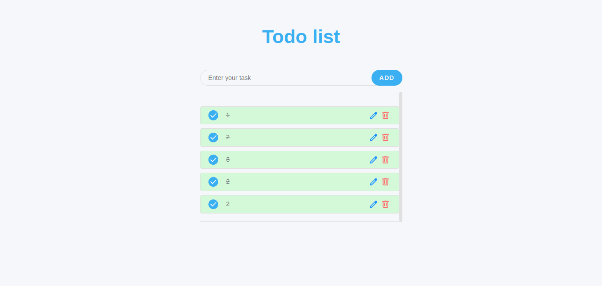

📝 Todo List App
A simple and elegant Todo List application built with HTML, CSS, and JavaScript. This app allows users to add, edit, delete, and mark tasks as completed — with modals for user-friendly interaction and localStorage to keep data persistent across sessions.

🚀 Features
✅ Add new tasks 
✏️ Edit existing tasks in a modal
🗑️ Delete tasks with confirmation
✅ Mark tasks as completed (with a custom checkbox)
💾 Save tasks in localStorage
📱 Responsive and mobile-friendly design

git clone https://github.com/yourusername/todolist-app.git

📚 Technologies Used
HTML5
CSS3
JavaScript (Vanilla)
LocalStorage API

📄 License
This project is open source and feel free to use it.